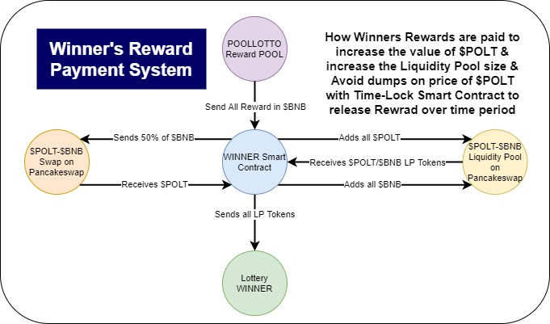

# ♾️ Winner's Reward System

Reward Payment System Remarks:

* Winning prizes are in terms of the token which user has staked whether $BNB or $CAKE
* Rewards are used to buy $POLT tokens equally
* equal amount of $CAKE/$BNB and $POLT are added to the liquidity Pool
* LP tokens are locked in a smart contract and winners get access to this contract 
* contract releases the LP tokens over a 3 months period to avoid from dumping the prices
* this system will always keep the value of $POLT at high levels and also there will be always enought funds in $POLT Liquidity Pools in common swaps.

