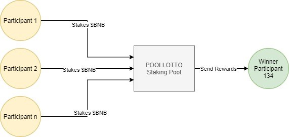

# 📚 Overview

Poollotto is a platform to give you chance to buy your lottery tickets without paying for it, just by staking you $BNB or $CAKE tokens in smart contract and rewards received from yield farming will be gathered as the pool prize which will be divided to 3 winners in daily and weekly draws.

Even if you are holding 1 or thousands of $BNB or $CAKE, it doesn't make any difference, because chances are chances, you might win thousands of USD by staking a single $CAKE as it is the nature of lotteries and no one knows who is gonna grab all of those prizes at the end of day.

As BSC is one of the most used network currently on the market and having lowest transaction fees and fair speed, it can be even used for small size staking but we are planning to run our platform in other blockchains in near future with support we are receiving from community.

Move next to see how it works?

