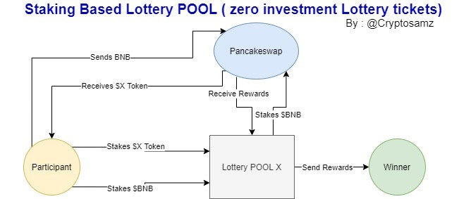

# ⚙️ How it works ?

it works in simple steps as follows:

1. User choose their desired pool \(Currently available in $BNB or $CAKE\)
2. they connect their Web3 Wallets to the platform 
3. Users adds the amount of their tokens willing to stake
4. Equal LP tokens will be sent back to users which will be as their lottery tickets as well
5. All rewards received from yield farming will be divided between 3 lucky winners daily

Remarks :

1. Users have to buy and hold at least 100 $POLT token for any activity in platform
2. Users get multiplier according to the number of their Holdings
3. Rewards are granted to winners by a time-lock contract to avoid price gets volatile
4. Tokens are staked in a smart contract and there won't be any access to funds by team.
5. Rewards are fully get paid back to winners in different manners and platform will not charge any extra fee
6. platform is a DAO and N one will manage it after main platform is launched

