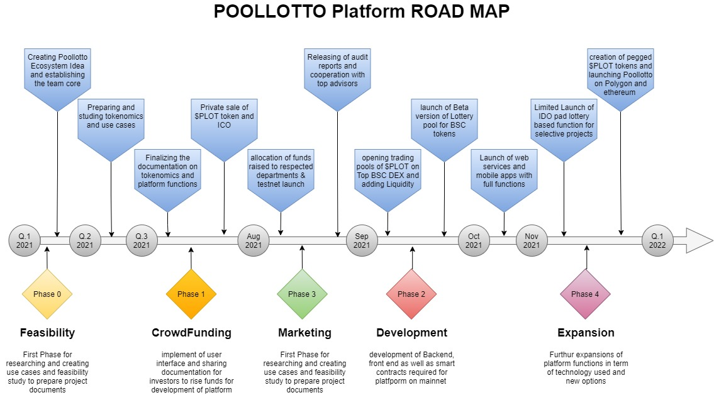

# 📣 Project Roadmap

POOLLOTTO will be developed in 4 phases and now we are in preparation phase or 0 phase, but at meanwhile our team has already started the development of platform as well.

1. At 0 phase we have already done feasibility studies and finalized our plans and documentation and already we are far beyond our timing plan as our development of platform started
2. It is the most important part for every project to get well funded by investors to achieve the desired goals and POOLLOTTO is also required to get fund raised by crowd sales for development as well as our vast marketing plans
3. As soon as our required funds raised, we will start the promotions via different strategies to attract more and more investors and users and make POOLLOTTO well-known among the other Dapps in the market which is the most important thing to survive in the competition.
4. We are miles ahead in our development as our team has already participated in many projects and all of them are familiar with Dapp developments and by the way, we have to confess that our platform is not complicated to develop.
5. This is not all we are planning, after fair launch of our Lottery gaming platform, there will be a expansion phase which is targeting to have a fair launch pad for new projects to raise their fund.

