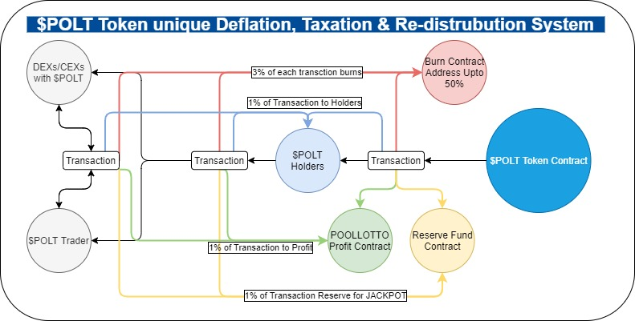

# 🚀 Deflation & Tax

$POLT will be having different mechanism to maintain price at stable level in bear markets and inflates in bull markets 

* From each transaction total 6% will be deducted from receiver address.
* 3% of tokens will directly send to a burn address until total supply becomes half of it's initial number which has be set to 5Billions
* 1% of each transactions will distributed to all token holders to maintain their amount of their lost tokens in their transactions and also as a mean of reward for those who are holding $POLT.
* 1% of token are transferred to a address which acts as Jackpot Reserve Pool \(JRP\).
* 1% is deducted from each transaction and sent to another reserve POOL \(NRP\) 

