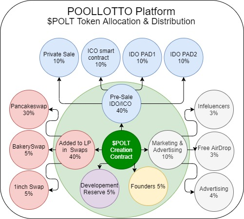

# 📊 Distribution & Allocation

Diagram below explains in details how the tokens are going to get distributed to user and how the raised fund are going to be allocated.

* Surprisingly only 5% of tokens are allocated to team members which is also locked in time lock smart contract to release those tokens over a 2 years, step by step
* Development reserve is also locked in a contract and can be used by use of governance voting system which ensures that those tokens are also can not be used in a way that community is not agree with.
* As we believe in marketing strategies, we have allocated 10% of total supply for fulfilling marketing and advertising goals to make sure sustainability of our platform and also guarantee the profits to our investors and token holders.
* in order to make the most from our initial offerings, we have 4 different steps to sale 40% of total supply by using different methods.
* the rest of tokens which are set to 40% are going to be added to liquidity pools in 3 different and most common Swap & Liquidity Pools to ensure easy access of to the token by all users.

